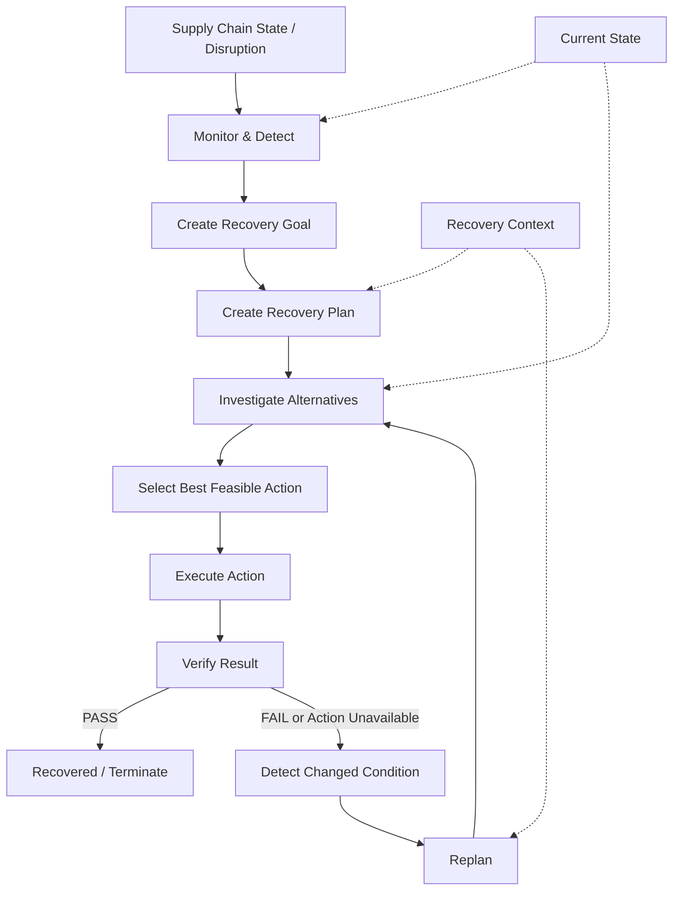
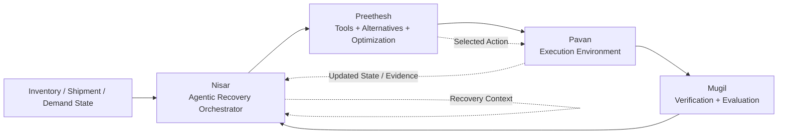
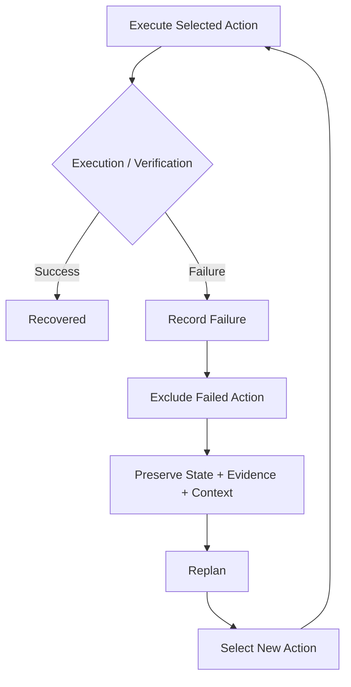

# 🤖 Autonomous Retail Supply Chain Recovery Agent

> **An agentic AI system that monitors supply-chain disruptions, investigates alternatives, executes recovery actions, verifies outcomes, and replans when conditions change.**

[](#-why-agentic)
[](#-hackathon-alignment)
[](#-demo)
[](#-team)

---

## 🌟 Overview

Retail supply chains can fail suddenly: a supplier becomes unavailable, a route changes, inventory drops, or another disruption occurs while a recovery action is already in progress.

The **Autonomous Retail Supply Chain Recovery Agent** is designed around that problem.

Instead of simply generating a recommendation, the system follows an **agentic recovery loop**:

**Monitor → Detect → Plan → Select → Execute → Verify → Adapt / Replan → Recover**

The key idea is that the system can respond to a **changing environment**, rather than treating recovery as a one-time decision.

---

## 🎯 Problem Statement

### Autonomous Retail Supply Chain Recovery Agent

> Build an autonomous supply-chain recovery agent that maintains service objectives when inventory, shipment, vendor, or demand conditions change.

The required workflow includes:

- Monitor inventory and shipment state
- Detect a disruption or constraint violation
- Investigate alternative vendors, routes, or allocations
- Compare feasible recovery actions under constraints
- Execute a simulated rerouting, purchase, allocation, or transfer
- Verify the resulting state
- Replan when the chosen alternative becomes unavailable or another disruption occurs

This project is built to demonstrate that workflow as an actual agentic system.

---

## 💡 Our Solution

The system separates recovery into specialized layers:

| Layer | Responsibility |
|---|---|
| **Nisar — Orchestration** | Controls the recovery lifecycle, tracks context, coordinates decisions, execution, verification, and replanning |
| **Preethesh — Decision Support** | Retrieves relevant tools/data, generates alternatives, applies constraints, optimizes, and selects an executable action |
| **Pavan — Execution** | Executes the selected simulated logistics action in the environment |
| **Mugil — Evaluation** | Verifies the execution result and determines whether recovery can continue or must be replanned |

### Core principle

> **Nisar orchestrates the recovery lifecycle → Preethesh selects the action → Pavan executes it → Mugil verifies it → Nisar adapts when necessary.**

---

# 🧠 Why Agentic?

A basic chatbot or simple LLM wrapper is not enough for this problem.

The system demonstrates the characteristics required for a genuine agentic workflow:

- **Planning** — creates a recovery goal and recovery plan
- **Decision-making** — selects among available recovery actions
- **Tool interaction** — uses specialized inventory, supplier, route, and execution components
- **Multi-step execution** — moves through selection → execution → verification
- **Evaluation** — checks the outcome of an executed action
- **Adaptation** — detects changed conditions and replans
- **State awareness** — carries recovery context and updated state between attempts

The agent therefore does not stop after producing a recommendation.

It closes the loop:

```text
Goal
  ↓
Decision
  ↓
Action
  ↓
Evaluation
  ↓
Adaptation
  ↓
Outcome
```

---

# 🔄 Agentic Recovery Workflow



### Recovery context tracks the loop

The orchestration layer preserves information needed for subsequent attempts, including:

- Current recovery stage
- Lifecycle events
- Failed / excluded action IDs
- Failure reason
- Latest available state
- Execution evidence
- Current recovery goal and plan

This prevents replanning from behaving like an unrelated fresh request.

---

# 🎬 Example Autonomous Recovery Scenario

The intended demo can be understood as a changing-condition recovery story:

```text
Warehouse needs 1,000 units
        ↓
Supplier A unavailable ❌
        ↓
Agent investigates alternatives
        ↓
Supplier B + Route 2
        ↓
Compare:
  Cost = ₹X
  Delivery = Y days
  Carbon = Z
        ↓
Agent selects best option
        ↓
Simulated purchase / reroute
        ↓
VERIFICATION ✓
        ↓
Route 2 becomes unavailable ❌
        ↓
Agent detects the change
        ↓
REPLANS
        ↓
New solution ✓
```

### Why this scenario matters

The important behavior is not simply finding the first alternative.

The stronger demonstration is:

> **The environment changes after a decision, and the agent responds by detecting the change and generating a new recovery path.**

That directly demonstrates **adaptation under disruption**.

---

# 🏗️ System Architecture



### Layer responsibilities

#### 1. Nisar — Agentic Recovery Orchestration

Nisar controls the recovery loop:

- Monitor and detect
- Create recovery goals
- Create state-bound recovery plans
- Request action selection
- Coordinate execution
- Coordinate verification
- Track failed actions
- Replan after failure or changed conditions
- Terminate on recovery or retry exhaustion

#### 2. Preethesh — Tools, Alternatives & Optimization

Preethesh provides the decision-support layer:

```text
Retrieve
   ↓
Generate alternatives
   ↓
Apply constraints
   ↓
Evaluate / optimize
   ↓
Select executable action
```

Selected actions preserve an `action_id` through the handoff to execution.

#### 3. Pavan — Execution

Pavan receives the selected action and executes the corresponding simulated operation, such as:

- Purchase
- Transfer
- Reroute

The execution response provides the result and available environment state/evidence.

#### 4. Mugil — Verification & Evaluation

Mugil evaluates the execution result and returns a verification decision:

```text
PASS + CONTINUE
        OR
FAIL / REPLAN
```

The orchestration layer uses that result to determine whether the recovery is complete or another recovery attempt is required.

---

# 🧩 Key Capabilities

### 🔍 Disruption Detection
The system begins recovery from changing supply-chain conditions.

### 🧭 Recovery Planning
A disruption is converted into a structured recovery goal and state-bound plan.

### 🔀 Alternative Selection
Multiple possible recovery actions can be investigated and compared before execution.

### ⚙️ Action Execution
The selected action is passed to the execution environment with its identity preserved.

### ✅ Verification
The result is evaluated instead of assuming that execution means success.

### ♻️ Adaptive Replanning
When execution or verification fails, the system excludes failed actions and searches for another path.

### 🧠 Persistent Recovery Context
Important information is retained across recovery attempts so the agent can continue the same recovery process coherently.

---

# 🔌 Action Handoff

The system uses a structured action contract between the decision and execution layers.

```text
SelectedAction
     │
     ▼
Preethesh Action Adapter
     │
     ▼
Pavan Action Request
     │
     ▼
Executor
     │
     ▼
Execution Result + Evidence
     │
     ▼
Mugil Verification
```

A selected action carries structured information such as:

```text
action_id
tool
operation
parameters
```

The `action_id` is preserved across the workflow so that the selected action and executed action remain traceable.

---

# 🔁 Replanning Logic

A key part of the project is **closed-loop recovery**.

When execution or verification fails:

1. Record the failure.
2. Preserve the failed action ID.
3. Exclude that action from the next selection attempt.
4. Preserve the latest available state/evidence.
5. Retain the current recovery context.
6. Generate/update the recovery plan.
7. Request another feasible action.
8. Execute and verify again.
9. Stop when recovered or when the retry limit is reached.



This is what makes the workflow adaptive rather than a one-shot recommendation pipeline.

---

# 🛠️ Tools & Decision Support

The decision-support layer is organized around specialized capabilities.

| Component | Purpose |
|---|---|
| **Inventory Tool** | Retrieve inventory information and support inventory-related operations |
| **Supplier Tool** | Retrieve supplier information and support supplier-related decisions |
| **Route Tool** | Retrieve route information and compare routing alternatives |
| **Alternative Generator** | Produce candidate recovery actions from retrieved facts |
| **Alternative Selector / Optimizer** | Filter and select a feasible action under the recovery requirements |
| **Action Adapter** | Convert the selected action into the execution contract |

The project intentionally keeps responsibilities separated so that **planning, decision support, execution, and verification are independently understandable**.

---

# 📁 Repository Structure

```text
Autonomous-Retail-Supply-Chain-Agent-Team_Codex/
│
├── Nisar/
│   ├── agent/
│   │   ├── contracts.py
│   │   ├── controller.py
│   │   ├── planner.py
│   │   └── adapters.py
│   ├── tests/
│   ├── PHASE_2.md
│   └── PHASE_3.md
│
├── Preethesh/
│   ├── clients/
│   ├── models/
│   ├── tools/
│   └── tests/
│
├── Pavan/
│   └── [execution / environment components]
│
├── Mugil/
│   └── dashboard/
│       └── app.py
│
└── README.md
```

> **Note:** This README intentionally does not invent additional files or framework details that are not part of the verified project material.

---

# 🚀 Demo

### Live Dashboard

**Streamlit deployment:**

https://autonomous-retail-supply-chain-agent-teamcodex-ma7rk9npmp46ays.streamlit.app/

### Recommended demo story

For the strongest demonstration, show the complete loop:

```text
1. Initial supply-chain disruption
2. Agent detects the problem
3. Recovery goal is created
4. Alternatives are investigated
5. Best available action is selected
6. Action is executed
7. Result is verified
8. Environment changes
9. Agent detects the new disruption
10. Agent replans
11. New solution is selected
12. Recovery completes
```

---

# ▶️ Running the Project

The project includes a deployed Streamlit dashboard for demonstration.

For local execution, use the repository's implementation and environment setup provided by the team. Exact local setup commands should follow the final repository configuration rather than assumptions made in this README.

### Dashboard entry point

```text
Mugil/dashboard/app.py
```

> **Security:** Never commit API keys, passwords, access tokens, or other confidential credentials to the repository.

---

# 👥 Team

| Member | Contribution |
|---|---|
| **Nisar** | 🧠 Agentic recovery orchestration, controller, monitoring/detection flow, planning, execution/verification coordination, replanning and recovery context |
| **Preethesh** | 🔧 Tools, alternative generation, constraints, optimization/selection and action adaptation |
| **Pavan** | ⚙️ Execution layer and simulated logistics environment |
| **Mugil** | ✅ Evaluation, verification, robustness and Streamlit dashboard |

### Team interaction

```text
                 ┌──────────────────────────┐
                 │          NISAR            │
                 │ Recovery Orchestration   │
                 └────────────┬─────────────┘
                              │
                              ▼
                 ┌──────────────────────────┐
                 │        PREETHESH         │
                 │ Tools / Alternatives /   │
                 │ Optimization / Selection │
                 └────────────┬─────────────┘
                              │
                              ▼
                 ┌──────────────────────────┐
                 │          PAVAN            │
                 │ Execution / Environment  │
                 └────────────┬─────────────┘
                              │
                              ▼
                 ┌──────────────────────────┐
                 │          MUGIL            │
                 │ Verification / Evaluation│
                 └────────────┬─────────────┘
                              │
                              ▼
                       Recovery Decision
                              │
                              └──────────► Nisar
```

---

# 📊 Validation & Integration

The team integrated the four layers into an end-to-end recovery workflow:

```text
Nisar
  ↓
Preethesh
  ↓
Pavan
  ↓
Mugil
  ↓
Recovered / Replan
```

The integrated project was reported by the team as having:

- **185/185 tests passing**
- **0 failed tests**
- A real end-to-end recovery workflow passing through the four team layers

---

# 🏆 Hackathon Alignment

This project is designed for the **Agentic AI Hackathon — Tech Zephyr 4.0 at IIT Bhubaneswar**.

The rulebook requires Stage 1 teams to submit a presentation, system architecture/workflow, source code/GitHub repository, a 3–5 minute demo video, and a runnable/deployed version where applicable. It also requires genuine agentic behavior rather than a basic chatbot or simple LLM wrapper.

The project demonstrates:

```text
Goal
  ↓
Decision
  ↓
Action
  ↓
Evaluation
  ↓
Adaptation
  ↓
Outcome
```

The demo also focuses on a changing-condition scenario where an initially selected alternative can become unavailable and trigger replanning.

The rules encourage demonstrations involving failures, unexpected inputs, tool failures, or changing conditions — which is directly reflected in the recovery loop.

---

# 🛡️ Responsible AI & Security

### Security

- Do **not** commit API keys.
- Do **not** commit passwords or access tokens.
- Do **not** expose confidential credentials in source code.

### Responsible development

The system is intended for simulated supply-chain recovery and decision support.

The project does not claim to provide unrestricted real-world autonomous authority over physical logistics.

### Transparency

The architecture separates:

- Orchestration
- Decision support
- Execution
- Verification

This makes it possible to explain what each component is responsible for and why a recovery decision was made.

---

# ⚠️ Limitations

The current implementation is a **simulated logistics recovery environment** and should not be interpreted as a production logistics control system.

In particular:

- Execution is simulated.
- Advanced real-world logistics data is not assumed.
- The execution environment does not provide every possible real-world metric.
- Advanced metrics should only be used when actually supplied by the underlying environment.
- Real-world deployment would require stronger authentication, authorization, observability, safety controls, data integrations, and operational validation.

The system intentionally avoids fabricating unavailable execution evidence.

---

# 🔮 Future Scope

Potential extensions include:

- More realistic logistics environments
- Richer shipment and demand signals
- Additional recovery action types
- Stronger constraint handling
- More sophisticated evaluation metrics
- Production-grade monitoring and observability
- Integration with real supply-chain APIs
- Human approval gates for high-impact actions
- More extensive failure and robustness testing

These are **future directions**, not claims about functionality currently implemented.

---

# 📜 Originality & Fair Play

This repository is submitted as the team's own project work.

Third-party libraries, APIs, models, datasets, and development tools should be acknowledged where applicable.

The hackathon rulebook prohibits plagiarism, unauthorized copying, fabrication/manipulation of results, misrepresentation of third-party work, and unauthorized access.

The team remains responsible for understanding and explaining the implementation.

---

# 📌 Project Philosophy

> **Don't just recommend a recovery action.**
>
> **Detect the disruption. Plan the recovery. Select an action. Execute it. Verify it. Adapt when reality changes.**

That closed-loop behavior is the core of the **Autonomous Retail Supply Chain Recovery Agent**.

---

## ⭐ If you find this project interesting

Give the repository a ⭐ and explore the architecture, recovery workflow, and live dashboard.

**Built for Tech Zephyr 4.0 — Agentic AI Hackathon | IIT Bhubaneswar**
