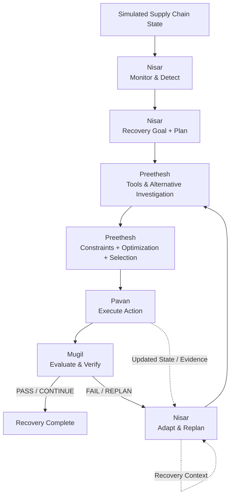
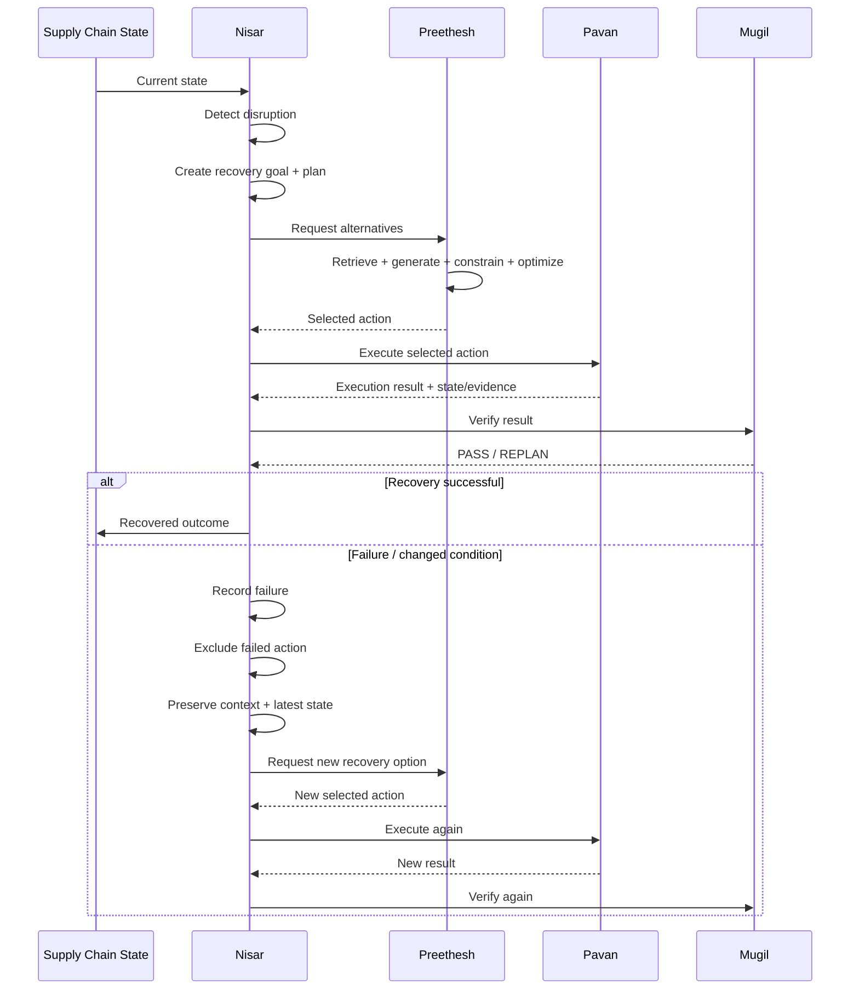

# 🤖 Autonomous Retail Supply Chain Recovery Agent

> **An agentic AI system that monitors a simulated retail supply chain, detects disruptions, investigates alternatives, executes recovery actions, verifies outcomes, and adapts when conditions change.**

<p align="center">

**Monitor → Detect → Plan → Decide → Act → Evaluate → Adapt → Recover**

</p>

---

## 🏆 Built for Tech Zephyr 4.0 — Agentic AI Hackathon

**Indian Institute of Technology Bhubaneswar (IIT Bhubaneswar)**

This project is designed around the hackathon's core requirement: a **genuine agentic system**, not merely a chatbot or an LLM wrapper.

The system demonstrates the complete decision loop:

> **Goal → Decision → Action → Evaluation → Adaptation → Outcome**

The rulebook specifically calls for planning, decision-making, multi-step execution, tool interaction, evaluation, and adaptation, and encourages demonstrations involving failures, tool failures, unexpected inputs, or changing conditions. fileciteturn3file0L24-L32 fileciteturn3file0L53-L59

---

## 🌟 What We Built

Retail supply chains can change in seconds:

- A supplier becomes unavailable.
- A shipment is delayed.
- A route becomes unavailable.
- Inventory changes.
- Demand increases.
- A previously selected recovery option is no longer valid.

A one-shot recommendation is not enough.

Our **Autonomous Retail Supply Chain Recovery Agent** is built as a closed-loop recovery system that:

1. **Monitors** the current supply-chain state.
2. **Detects** disruptions and constraint violations.
3. **Creates a recovery goal.**
4. **Investigates alternatives.**
5. **Selects a feasible recovery action.**
6. **Executes** the action in a simulated environment.
7. **Verifies** the resulting state.
8. **Adapts and replans** if the environment changes or the action fails.
9. **Terminates** when recovery succeeds or no feasible recovery remains.

---

# 🎯 Problem Statement

### Autonomous Retail Supply Chain Recovery Agent

Build an autonomous supply-chain recovery agent that maintains service objectives when **inventory, shipment, vendor, or demand conditions change**.

The required workflow is:

```text
Monitor inventory / shipment state
              ↓
Detect disruption / constraint violation
              ↓
Investigate vendors / routes / allocations
              ↓
Compare feasible recovery actions
              ↓
Execute simulated recovery action
              ↓
Verify resulting state
              ↓
Replan when conditions change
```

This project implements that workflow as a coordinated multi-layer recovery system.

---

# 🧠 Why This Is Agentic

A conventional application could simply say:

> "Supplier A is unavailable. Use Supplier B."

Our system goes further.

### It maintains a recovery loop.

```text
┌───────────────┐
│ Supply State  │
└───────┬───────┘
        ↓
┌────────────────┐
│ Monitor / Detect│
└───────┬────────┘
        ↓
┌────────────────┐
│ Recovery Goal  │
└───────┬────────┘
        ↓
┌────────────────┐
│ Plan / Decide  │
└───────┬────────┘
        ↓
┌────────────────┐
│ Execute Action │
└───────┬────────┘
        ↓
┌────────────────┐
│ Evaluate Result│
└───────┬────────┘
        ↓
   ┌────┴─────┐
   │           │
 PASS       FAILURE /
   │        CHANGE
   ↓           ↓
RECOVER     REPLAN
               │
               └──────→ Decide Again
```

### Agentic capabilities demonstrated

| Capability | How the project demonstrates it |
|---|---|
| 🧭 **Planning** | Converts detected disruptions into structured recovery goals and plans |
| 🧠 **Decision-making** | Selects an appropriate feasible recovery action |
| 🔧 **Tool interaction** | Investigates inventory, suppliers, routes, and other decision inputs |
| 🔄 **Multi-step execution** | Coordinates selection → execution → verification |
| ✅ **Evaluation** | Checks the result instead of assuming execution succeeded |
| ♻️ **Adaptation** | Responds to failures and changing conditions |
| 🧩 **State awareness** | Carries state, evidence, lifecycle events, and recovery context |
| 🚫 **Failure handling** | Excludes failed actions and attempts another recovery path |

---

# 🏗️ System Architecture



## Four-layer architecture

### 🧠 01 — Nisar: Agentic Recovery Orchestration

**The control loop.**

Nisar owns the agent's recovery lifecycle:

```text
Monitor
  ↓
Detect
  ↓
Create Recovery Goal
  ↓
Create Recovery Plan
  ↓
Request Decision
  ↓
Execute
  ↓
Verify
  ↓
Recover OR Replan
```

Key responsibilities:

- Read current inventory, shipment, and demand state
- Detect inventory shortages
- Detect shipment delays
- Detect vendor issues
- Detect demand spikes
- Detect constraint violations
- Build recovery goals
- Coordinate the other layers
- Maintain recovery context across attempts
- Track failed / excluded action IDs
- Preserve the latest state and execution evidence
- Trigger replanning after failure or changed conditions

---

### 🔧 02 — Preethesh: Tools, Alternatives & Optimization

**The decision-support layer.**

Preethesh investigates the available recovery space.

```text
Retrieve
   ↓
Generate Alternatives
   ↓
Check Feasibility
   ↓
Apply Constraints
   ↓
Compare Options
   ↓
Select Best Action
```

Decision-support components include:

- Inventory tools
- Vendor / supplier tools
- Route tools
- Cost and carbon calculations
- Alternative generation
- Optimization / selection
- Action adaptation for execution

The selected action is handed to Pavan rather than being executed directly by the decision layer.

---

### ⚙️ 03 — Pavan: Simulation & Execution

**The action layer.**

Pavan provides the simulated logistics environment and executes recovery actions.

The environment represents supply-chain elements such as:

- Warehouses
- Inventory
- Vendors
- Shipments
- Routes
- Demand

Supported recovery operations include simulated:

- Purchase
- Transfer
- Reroute

Pavan also provides controlled failure conditions for the agentic demo, such as:

- Vendor becomes unavailable
- Route becomes unavailable
- Inventory changes
- Shipment is delayed
- Demand increases

This is essential because the agent must react to **what actually happens after a decision**.

---

### ✅ 04 — Mugil: Evaluation, Verification & Visibility

**The evaluation layer.**

Mugil verifies whether the recovery action produced the intended result.

The evaluation layer covers:

- Inventory verification
- Delivery verification
- Cost verification
- Carbon verification when evidence is available
- Recovery verification
- Recovery metrics
- Scenario testing
- Robustness testing
- Streamlit dashboard / activity timeline

The dashboard is intentionally a visualization layer rather than the agent itself:

```text
Streamlit Dashboard
        ↓
Main Controller / Agent
        ↓
Tools
        ↓
Execution
        ↓
Verification
```

---

# 🔄 End-to-End Agentic Loop



---

# 🎬 Flagship Demo Scenario

The strongest demonstration of the system is not a static recommendation.

It is **recovery under changing conditions**.

### Scenario

```text
Warehouse needs 1,000 units
          ↓
Supplier A unavailable ❌
          ↓
Agent investigates alternatives
          ↓
Supplier B + Route 2
          ↓
Compare:
  Cost = X
  Delivery = Y days
  Carbon = Z
          ↓
Agent selects best feasible option
          ↓
Simulated purchase / reroute
          ↓
VERIFICATION ✓
          ↓
Route 2 becomes unavailable ❌
          ↓
Agent detects the change
          ↓
REPLANS ♻️
          ↓
New solution selected ✓
          ↓
Recovery
```

## Why this demo is powerful

The system does **not** assume that its first decision remains valid.

The environment changes.

The agent observes the change.

The failed/unavailable path is excluded.

The agent investigates again.

A new recovery action is selected.

That is the project's core demonstration of:

> **Decision → Action → Evaluation → Adaptation**

---

# 🔁 Failure Recovery & Replanning

Replanning is a first-class part of the architecture.

When an action fails or verification requires replanning:

### 1. Record the failure

The recovery context records what went wrong.

### 2. Exclude the failed action

The failed `action_id` is retained so the same failed option is not blindly selected again.

### 3. Preserve the latest state

If execution provides updated state/evidence, it becomes available to the next recovery attempt.

### 4. Preserve context

The recovery process retains:

- Current stage
- Lifecycle events
- Failed action IDs
- Failure reason
- Latest state
- Execution evidence
- Current goal / plan

### 5. Replan

A new recovery request is produced using the latest available information.

### 6. Retry

The system selects another feasible action and executes it.

```text
Failure
  ↓
Record
  ↓
Exclude failed action
  ↓
Preserve state + evidence + context
  ↓
Replan
  ↓
Select new action
  ↓
Execute
  ↓
Verify
  ↓
Recovered / Replan again
```

---

# 🔌 Structured Action Handoff

A major design principle is that each layer has a clear responsibility and a structured contract.

```text
Preethesh
SelectedAction
     │
     │ action_id
     │ tool
     │ operation
     │ parameters
     ▼
Nisar orchestration
     │
     ▼
Pavan action request
     │
     ▼
Execution
     │
     ├── status
     ├── action_id
     ├── result
     └── available state/evidence
     ▼
Mugil verification
     │
     ▼
PASS / REPLAN
     │
     ▼
Nisar
```

The `action_id` provides traceability across the decision → execution → verification flow.

---

# 🧰 Decision-Support Flow

Preethesh's decision layer follows a structured pipeline:

```text
Recovery Goal
      ↓
Retrieve relevant information
      ↓
Generate alternatives
      ↓
Check feasibility
      ↓
Apply cost / delivery / carbon constraints
      ↓
Compare remaining options
      ↓
Select action
      ↓
Adapt action contract
      ↓
Pavan
```

### Example decision

```text
Goal:
Move 80 units within 24 hours

Candidate A
Cost: 249k
Time: 12h
Carbon: 25kg
→ FEASIBLE

Candidate B
Cost: 236k
Time: 30h
Carbon: 20kg
→ NOT FEASIBLE

Warehouse Transfer
Cost: 225k
Time: 10h
Carbon: 18kg
→ FEASIBLE

                 ↓

Selected:
Warehouse Transfer
```

The important boundary is:

> **Preethesh decides. Pavan executes.**

---

# 🖥️ Dashboard

The deployed Streamlit dashboard is designed to make the agent's behavior visible.

### Dashboard flow

```text
1. CURRENT STATE
        ↓
2. DISRUPTION
        ↓
3. RECOVERY GOAL
        ↓
4. ALTERNATIVES
        ↓
5. SELECTED ACTION
        ↓
6. EXECUTION
        ↓
7. FAILURE / CHANGED CONDITION
        ↓
8. REPLANNING
        ↓
9. VERIFICATION
        ↓
10. FINAL RESULT
```

### Activity timeline

The workflow can also be presented as a chronological recovery trace:

```text
Goal created
     ↓
Disruption detected
     ↓
Vendor search
     ↓
Route search
     ↓
Alternatives generated
     ↓
Action selected
     ↓
Action executed
     ↓
Failure detected
     ↓
Replanning
     ↓
New action
     ↓
Verification
     ↓
Recovery completed
```

---

# 🚀 Live Demo

### 🌐 Streamlit Dashboard

**Live application:**

https://autonomous-retail-supply-chain-agent-teamcodex-ma7rk9npmp46ays.streamlit.app/

### Recommended live demonstration

For maximum impact, demonstrate:

1. A real simulated disruption.
2. Detection by the recovery agent.
3. Recovery-goal creation.
4. Alternative investigation.
5. Action selection.
6. Action execution.
7. Verification.
8. A controlled environment change/failure.
9. Detection of the new condition.
10. Replanning.
11. A new recovery action.
12. Final verification.

The hackathon rules require the final demonstration to be live and prohibit relying on pre-recorded demonstrations, mocked outputs, or fabricated results as a replacement for the live demonstration. fileciteturn3file0L78-L87

---

# 📁 Repository Structure

```text
Autonomous-Retail-Supply-Chain-Agent-Team_Codex/
│
├── Nisar/
│   ├── agent/
│   │   ├── monitor.py
│   │   ├── disruption_detector.py
│   │   ├── planner.py
│   │   ├── controller.py
│   │   ├── contracts.py
│   │   └── adapters.py
│   ├── tests/
│   ├── PHASE_2.md
│   └── PHASE_3.md
│
├── Preethesh/
│   ├── clients/
│   ├── models/
│   ├── tools/
│   └── tests/
│
├── Pavan/
│   ├── simulation/
│   ├── execution/
│   └── [environment / failure-handling components]
│
├── Mugil/
│   ├── evaluation/
│   └── dashboard/
│       └── app.py
│
└── README.md
```

> **Implementation note:** The role documents describe the intended responsibilities and checkpoints. The repository may contain additional implementation files as the team evolves the project.

---

# 👥 Team Contributions

## 🧠 Nisar — Agentic Recovery Orchestration

**Owns the agent's control loop.**

### Core contribution

```text
Monitor
→ Detect
→ Goal
→ Plan
→ Coordinate
→ Execute
→ Verify
→ Replan
```

### Key work

- Current-state monitoring
- Disruption detection
- Recovery goal creation
- Recovery planning
- Controller / orchestration
- Cross-layer contracts and adapters
- Failure tracking
- Recovery context
- Replanning
- End-to-end coordination

### Directly supports

- Monitoring inventory/shipment state
- Disruption detection
- Goal-driven execution
- Planning
- Decision coordination
- Agentic workflow and autonomy

---

## 🔧 Preethesh — Tools, Alternatives & Optimization

**Owns the decision-support layer.**

### Core contribution

```text
Retrieve
→ Generate
→ Constrain
→ Optimize
→ Select
```

### Key work

- Inventory tool
- Vendor/supplier tool
- Route tool
- Cost/carbon decision inputs
- Alternative generation
- Feasibility checks
- Optimization
- Selected-action generation
- Action adaptation
- Nisar/Pavan integration

### Directly supports

- Alternative vendor investigation
- Route investigation
- Allocation investigation
- Tool/environment interaction
- Optimization under constraints
- Decision-making

---

## ⚙️ Pavan — Simulation, Execution & Failure Environment

**Owns the simulated world and action execution.**

### Core contribution

```text
Environment
→ State
→ Action
→ Result
→ Failure / Change
```

### Key work

- Simulated supply-chain environment
- State management
- Purchase execution
- Transfer execution
- Reroute execution
- Controlled failure simulation
- State-changing logistics actions
- Execution results
- Nisar integration

### Directly supports

- Simulated purchase/rerouting/allocation/transfer
- State-changing actions
- Action + observation
- Failure handling
- Adaptation
- Replanning
- Changing-condition demonstrations

---

## ✅ Mugil — Evaluation, Verification, Robustness & Dashboard

**Owns the evaluation and visibility layer.**

### Core contribution

```text
Verify
→ Measure
→ Test
→ Visualize
```

### Key work

- Recovery verification
- Inventory/delivery verification
- Evaluation metrics
- Scenario testing
- Robustness testing
- Streamlit dashboard
- Activity timeline
- End-to-end visibility

### Directly supports

- Evaluation
- Verification
- Robustness
- Prototype functionality / UX
- Before/after evidence
- Failure-scenario presentation

---

# 🧪 Validation

The integrated project was reported by the team as reaching:

> **185 / 185 tests passing — 0 failed**

The team also validated the end-to-end workflow:

```text
Nisar
  ↓
Preethesh
  ↓
Pavan
  ↓
Mugil
  ↓
Recovered / Replan
```

The validation claim is presented as the team's reported integration result; this README does not add fabricated benchmark numbers.

---

# 🏆 Hackathon Alignment

The project is intentionally structured around the official Stage 1 requirements.

| Hackathon requirement | Project response |
|---|---|
| **Meaningful problem domain** | Retail supply-chain recovery |
| **Genuine agentic behavior** | Planning + decision + execution + evaluation + adaptation |
| **System architecture / workflow** | Multi-layer architecture + recovery-loop diagrams |
| **Source code / GitHub repository** | Complete team repository |
| **3–5 minute demo video** | Changing-condition recovery scenario |
| **Runnable / deployed version** | Live Streamlit dashboard |
| **Goal → Decision → Action → Evaluation → Adaptation → Outcome** | Core system loop |
| **Failure / changing conditions** | Controlled vendor/route/environment changes and replanning |
| **Technical explanation** | Clear separation of orchestration, decision support, execution, and verification |

The official rulebook states that Stage 1 requires a presentation, system architecture/workflow, source code/GitHub repository, a 3–5 minute demo video, and a runnable/deployed version where applicable. fileciteturn3file0L43-L50

It also states that judges may ask teams to explain the architecture, code, models, tools, and design decisions. fileciteturn3file0L33-L42

---

# 🎯 Why Our Architecture Fits the Judging Model

The system naturally maps to the capabilities emphasized by the challenge:

```text
                    AGENTIC RECOVERY

        ┌─────────────────────────────────┐
        │            NISAR                │
        │ Monitor → Detect → Plan         │
        └───────────────┬─────────────────┘
                        ↓
        ┌─────────────────────────────────┐
        │          PREETHESH              │
        │ Tools → Alternatives → Optimize │
        └───────────────┬─────────────────┘
                        ↓
        ┌─────────────────────────────────┐
        │            PAVAN                │
        │ Execute → Observe → Change      │
        └───────────────┬─────────────────┘
                        ↓
        ┌─────────────────────────────────┐
        │            MUGIL                │
        │ Evaluate → Verify → Measure     │
        └───────────────┬─────────────────┘
                        ↓
                   NISAR AGAIN
                        ↓
                   REPLAN ♻️
```

This creates an actual **closed-loop agent**, rather than a linear prediction pipeline.

---

# 🔐 Security & Responsible AI

The hackathon rules prohibit intentionally facilitating harmful activities and require safeguards for sensitive areas or personal data. fileciteturn3file0L102-L114

This project is designed as a **simulated supply-chain recovery system**.

### Repository security

**Never commit:**

- API keys
- Passwords
- Access tokens
- Private credentials
- Confidential environment secrets

The hackathon rulebook explicitly states that API keys, passwords, tokens, and confidential credentials must not be included in the repository. fileciteturn3file0L43-L52

### Responsible development

The project:

- Uses a simulated logistics environment.
- Separates decision support from execution.
- Verifies actions rather than blindly assuming success.
- Preserves available execution evidence.
- Does not claim unrestricted autonomous authority over real-world physical logistics.

---

# ⚠️ Limitations

This project is a **hackathon prototype built around a simulated logistics environment**.

It should not be interpreted as a production supply-chain control platform.

Current limitations include:

- Simulated rather than real logistics execution
- Limited environment realism
- Limited real-world data integrations
- Advanced operational metrics depend on actual available evidence
- No claim of unrestricted real-world autonomous execution
- Production deployment would require stronger authentication, authorization, observability, safety controls, human-approval policies, and operational validation

The system intentionally avoids inventing unavailable execution evidence.

---

# 🔮 Future Scope

Possible extensions include:

- More realistic logistics simulation
- Richer shipment and demand signals
- Additional vendors and route types
- More recovery-action types
- Stronger constraint handling
- More detailed evaluation metrics
- Production-grade monitoring and observability
- Real supply-chain API integrations
- Human approval gates for high-impact actions
- Larger robustness and failure scenario suites

These are **future directions**, not claims about the current implementation.

---

# 📜 Originality & Fair Play

This project is developed as the team's own hackathon submission.

The hackathon rules prohibit:

- Plagiarism
- Unauthorized copying
- Submission of another team's work
- Sharing solutions between competing teams
- Fabrication or manipulation of results
- Misrepresentation of third-party work
- Unauthorized access
- Deliberate exploitation of the judging process

Third-party libraries, APIs, models, and datasets should be acknowledged where applicable. fileciteturn3file0L89-L101

---

# 📌 Project Philosophy

> ### Don't just recommend a recovery action.
>
> **Detect the disruption.**
>
> **Plan the recovery.**
>
> **Select the action.**
>
> **Execute it.**
>
> **Verify the outcome.**
>
> **Adapt when reality changes.**

That closed-loop behavior is the core of the **Autonomous Retail Supply Chain Recovery Agent**.

---

## ⭐ Built by the Team

**Nisar · Preethesh · Pavan · Mugil**

### Tech Zephyr 4.0 — Agentic AI Hackathon
**IIT Bhubaneswar**

**Monitor → Decide → Act → Verify → Adapt → Recover ♻️**
